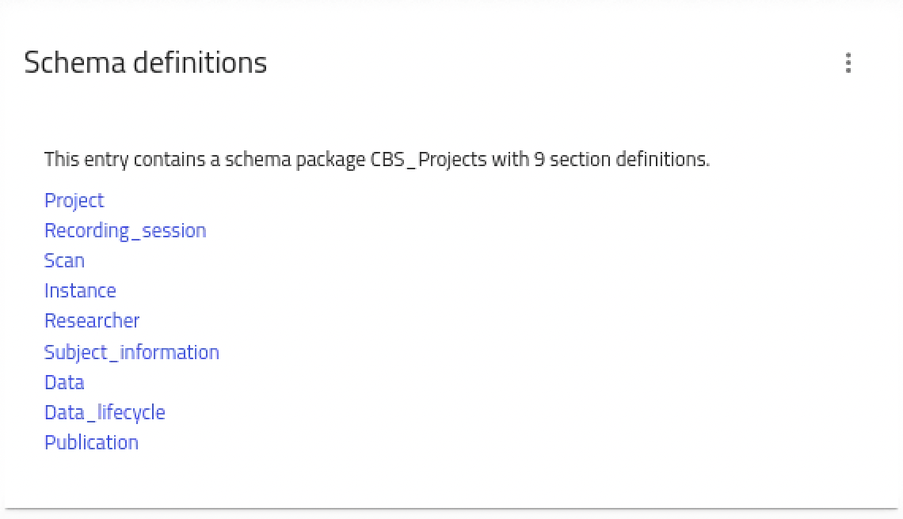
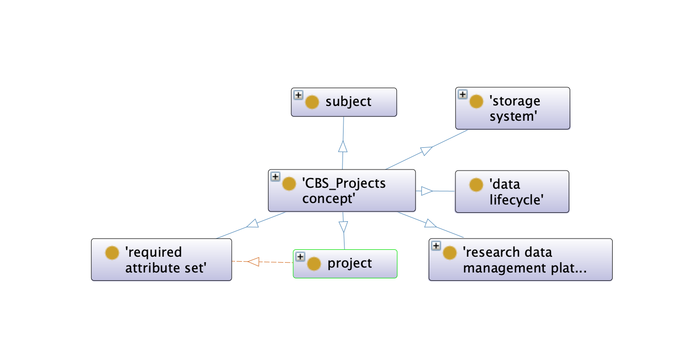
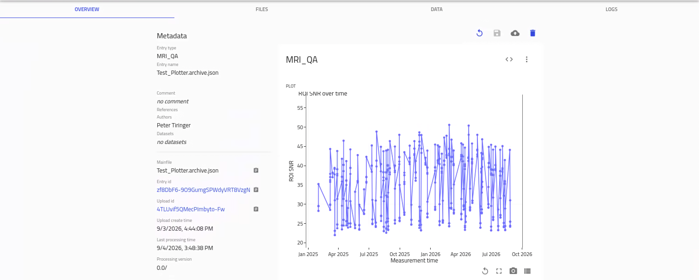

# OSCARS Final Deliverable – September 2026

## Frozen Submodule Versions

This deliverable uses fixed commits of the included submodules to ensure that the exact software versions used for the final demonstrator can be reproduced.

- `packages/nomad-FAIR`: [`a6c658e`](https://github.com/PTiringer/nomad-FAIR/tree/a6c658ea6f7b69d70cc9dea771ba3d60fd79e2ea)
- `packages/wiki-page`: [`a09f673`](https://github.com/PTiringer/wiki-page/tree/a09f6734cd3d1c85df0a45b7ec586b03aa748505)
- `packages/schemas`: [`3926d77`](https://github.com/PTiringer/schemas/tree/3926d77e609675c57a40203279d1e2f9cc4564f8)
- `packages/MPI_CBS_scientific_staff_database`: [`e8b820f`](https://github.com/PTiringer/MPI_CBS_scientific_staff_database/tree/e8b820fbb581effb8a23102e7bff5f807fa8f224)
- `packages/qa-plotter`: [`af1d940`](https://github.com/PTiringer/qa-plotter/tree/af1d94090163e5efb9a7b80d2c5e5184bddd5d85)


## Implement Solutions for Raw Data Retrieval from NOMAD

At MPI CBS, MRT measurement data are stored as raw data in separate storage folders, while the corresponding measurement metadata are maintained in an existing legacy database.

For the deliverable, the new `qa-plotter` plugin provides an integration between this existing infrastructure and NOMAD. It retrieves the relevant information from the legacy database and makes the measurement data and associated metadata accessible through NOMAD.

In parallel, a new schema for representing scientific MRT projects at MPI CBS has been finalized. The schema provides a structured representation of the relevant project, measurement, personnel, and related metadata.




The schema has additionally been converted into an OWL ontology and mapped to relevant external ontologies. This provides a semantic representation of the metadata and improves interoperability with other research data management systems and standards.



The resulting metadata are indexed by NOMAD and can therefore be searched and filtered using NOMAD's search functionality.

Internal references between NOMAD entries and the underlying data storage provide access to the associated raw datasets without requiring the original data storage structure to be replaced.

### Ontology Mapping

The CBS Projects schema has been converted into an OWL ontology and aligned with established external ontologies and semantic vocabularies. These mappings improve semantic interoperability and allow concepts represented in the CBS schema to be related to established standards.

The ontology currently uses concepts and properties from, among others:

- **Dublin Core Terms (DCTERMS)** – general metadata such as titles, descriptions, provenance, licenses, relations, and access rights.
- **PROV-O** – representation of provenance, activities, agents, entities, software agents, and derivation relationships.
- **DCAT** – representation of datasets, distributions, and data resources.
- **W3C Organization Ontology (ORG)** – organizations, memberships, organizational roles, and affiliations.
- **FOAF** – representation of people and documents.
- **Schema.org** – general-purpose concepts for describing research-related entities and metadata.
- **SKOS** – semantic mappings and relationships between concepts.
- **OBI (Ontology for Biomedical Investigations)** – concepts describing investigations, studies, instruments, and biomedical research processes.
- **IAO (Information Artifact Ontology)** – representation of information content entities and documents.
- **DUO (Data Use Ontology)** – representation of data-use conditions and restrictions.
- **DataCite Ontology** – identifiers for research resources and persons.
- **FaBiO (FRBR-aligned Bibliographic Ontology)** – scientific publications and other research outputs, including journal articles, research papers, reports, presentations, and posters.
- **CiTO (Citation Typing Ontology)** – representation of citations and citation relationships.
- **SPDX** and **Creative Commons** – representation of licenses and licensing information.
- **ODRL (Open Digital Rights Language)** – policies, permissions, and duties related to data access and usage.
- **DPV (Data Privacy Vocabulary)** – concepts related to data protection and privacy.
- **PREMIS** – concepts related to digital preservation and storage.
- **W3C Time Ontology** – representation of temporal concepts and intervals.
- **vCard Ontology** – representation of persons and contact-related information.
- **UBERON** – anatomical concepts used for biomedical metadata.
- **NCBI Taxonomy** – representation of organism and species information.
- **CodeMeta** – metadata describing research software.
- **BIBO (Bibliographic Ontology)** – bibliographic and publication-related concepts.
- **ADMS (Asset Description Metadata Schema)** – representation of identifiers and semantic assets.


## Implement Solutions for Data Analysis in the NOMAD Remote Tools Hub

The second part of the deliverable extends the integration from discovering and retrieving scientific data to working with these data directly within the NOMAD environment.

The `qa-plotter` plugin integrates a normalizer that obtains the relevant information from the legacy infrastructure and transforms it into a representation that can be handled and displayed by NOMAD.

NOMAD NORTH has been activated and configured with a Jupyter Notebook container. NORTH provides an interactive analysis environment connected to the NOMAD infrastructure and allows users to work with the available research data without requiring a separate local analysis environment.

An example Jupyter Notebook is included in the deliverable to demonstrate how the data exposed through `qa-plotter` can be accessed and used from within the NOMAD Remote Tools Hub.

The demonstrated workflow is:

**Legacy MRT data → `qa-plotter` normalizer → NOMAD → NORTH / Jupyter Notebook → interactive data analysis**

This complements the raw-data retrieval functionality described above. While the first part establishes the mechanisms required to discover and access existing research data, this part demonstrates how the accessible data can subsequently be used in an interactive analysis environment.




## Prepare Data Analysis Tools for the Scientific Demonstrator and Contribute to the Dissemination of the Results

The Scientific Demonstrator combines the individual components developed within the project into an end-to-end scientific workflow.

The demonstrator integrates ontology-based searches for scientific datasets stored in remote data storage systems. Users can define search criteria based on the available metadata and ontology concepts to identify datasets relevant to a particular scientific question.

Datasets matching the specified filters are retrieved from the corresponding remote storage systems.

The retrieved datasets can subsequently be processed using the EWOKS workflow manager. EWOKS provides the workflow execution layer for applying predefined data-processing and analysis workflows to the selected datasets.

Results produced by these workflows are registered in NOMAD. This allows derived data and analysis results to become part of the same research data management environment as the original datasets and their metadata.

The resulting end-to-end workflow is:

**Ontology-based search → dataset discovery → remote data retrieval → EWOKS processing → generated results → registration in NOMAD**

An example of the Scientific Demonstrator is available in NOMAD:

https://nomad-lab.eu/oasis-b/projects/wfCObRdJRPeTG-T-U_fH0Q

The solution has additionally been prepared to provide screenshots and other visual material documenting the implemented workflow. These materials will be used for dissemination activities, including talks and poster contributions at the NoBUGS meeting at the end of September 2026.


# Installation

Start by forking this [main repository](https://github.com/FAIRmat-NFDI/nomad-distro-dev) that will house all your plugins.

# NOMAD Dev Distribution

Benefits

- One-step installations: Install everything at once with editable mode. Since all packages are installed in editable mode, changes you make to the code are immediately reflected. Edit your code and rerun tests or the application as needed, without needing to reinstall the packages.
- Centralized codebase: Easier navigation and searching across projects.
- Better editor support: Improved autocompletion and refactoring.
- Consistent tooling: Shared linting, testing, and formatting.
- Flexible plugin management: If you're developing plugins for different deployments with varying requirements, you can easily create different branches for each deployment and configure which plugins to use in the specific branch for that deployment.

Below are instructions for how to create a dev environment for developing [nomad-lab](https://gitlab.mpcdf.mpg.de/nomad-lab) and its plugins.

## Basic infra

1. Ensure you have [docker](https://docs.docker.com/engine/install/) installed. Docker nowadays comes with `docker compose` built in. Prior, you need to install the stand-alone [docker-compose](https://docs.docker.com/compose/install/).

2. Install [uv](https://docs.astral.sh/uv/getting-started/installation/) (v0.5.14 and above). `uv` is required to manage your development environment. It's recommended to use the standalone installer or perform a global installation. (`brew install uv` on macOS or `dnf install uv` on Fedora).

3. Install [node.js](https://nodejs.org/en) (v20) and [yarn](https://classic.yarnpkg.com/en/docs/install/)(v1.22). We will use it to setup the GUI.

4. For Windows users, nomad-lab processing doesn't work natively on the platform. We highly recommend using the [Devcontainer](https://marketplace.visualstudio.com/items?itemName=ms-vscode-remote.remote-containers) plugin in VSCode to run the repository within a container, or alternatively, using [Windows Subsystem for Linux](https://learn.microsoft.com/en-us/windows/wsl/about) (WSL) to run the project.

5. Clone the forked repository.

   ```bash
   git clone https://github.com/<your-username>/nomad-distro-dev.git
   cd nomad-distro-dev
   ```

6. Run the docker containers with `docker compose` in [detached](https://docs.docker.com/guides/language/golang/run-containers/#run-in-detached-mode) (--detach or -d) mode.

   ```sh
   docker compose up -d
   ```

   To shutdown the containers:

   ```sh
   docker compose down
   ```

## Developing nomad + plugins locally.

This guide explains how to set up a streamlined development environment for nomad-lab and its plugins using [`uv` workspaces](https://docs.astral.sh/uv/concepts/workspaces/#workspaces). This approach eliminates the need for multiple `pip install` commands by leveraging a monorepo and a single installation step.

In this example, we'll set up the development environment for a developer working on the following plugins: `nomad-parser-plugins-electronic` and `nomad-measurements`. The first plugin already comes as a dependency in this dev distribution. On the contrary, the second plugin is not listed as a dependency. In the following, we take a look at how to setup the environment in these two situations.

### Step-by-Step Setup

1. Update submodules

   This loads the `nomad-lab` package which is already listed as a submodule.

   ```bash
   git submodule update --init --recursive
   ```
> [!TIP]
>
> To get more information on how `git submodules` are used to structure bigger software projects, read the this [Github blog entry](https://github.blog/open-source/git/working-with-submodules/) on this topic.

2. Add local plugins

   Assuming that you already have a git repo for your plugins, add them to the `packages/` directory as submodules. In case, you are looking to create a plugin repo from scratch, consider using our plugin template: [nomad-plugin-template](https://github.com/FAIRmat-NFDI/nomad-plugin-template).

   ```bash
   git submodule add https://github.com/<package_name>.git packages/<package_name>
   ```

   Repeat for all the plugin packages you want to add and develop. For our example:

   ```bash
   git submodule add https://github.com/nomad-coe/electronic-parsers.git packages/nomad-parser-plugins-electronic

   git submodule add https://github.com/FAIRmat-NFDI/nomad-measurements.git packages/nomad-measurements
   ```

3. Modify `pyproject.toml`

   To ensure `uv` recognizes the local plugins (a local copy of your plugin repository available in `packages/` directory), we need to make some modifications in the `pyproject.toml`.  These include adding the plugin package to `[project.dependencies]` and `[tool.uv.sources]` tables. The packages listed under `[tool.uv.sources]` are loaded by `uv` using the local code directory made available under `packages/` with the previous step. This list will contain all the plugins that we need to actively develop in this environment.

   If a new plugin is **not** listed under `[project.dependencies]`, we need to first add it as a dependency. After adding the dependencies, update the `[tool.uv.sources]` section in your `pyproject.toml` file to reflect the new plugins.

   There are two ways of adding to these two lists:

   a) You can use `uv add` which adds the dependency and the source in `pyproject.toml` and sets up the environment.  Adding multiple plugins should be done in a single command:
   ```bash
   uv add packages/nomad-measurements packages/PLUGIN_B packages/PLUGIN_C
   ```
   In this example, we're just adding one:
   ```bash
   uv add packages/nomad-measurements
   ```

   b) You can modify the `pyproject.toml` file manually:

     ```toml
     [project]
     dependencies = [
     ...
     "nomad-measurements",
     ]

     [tool.uv.sources]
     ...
     nomad-measurements = { workspace = true }
     ```

   Some of the plugins are already listed under `[project.dependencies]`. If you want to develop one of them, you have to add them under `[tool.uv.sources]`. We do this for `nomad-parser-plugins-electronics`.

   ```toml
   [tool.uv.sources]
   ...
   nomad-parser-plugins-electronic = { workspace = true }
   ```

 > [!NOTE]
 > You can also use `uv` to install a specific branch of the plugin without adding a submodule locally.
 >
 > ```bash
 > uv add https://github.com/FAIRmat-NFDI/nomad-measurements.git --branch <specific-branch-name>
 > ```
 > This command will not include the plugin in the `packages/` folder, and hence this plugin will not be editable.

A complete list of plugins maintained by FAIRmat-NFDI can by found in the [overview page](https://github.com/FAIRmat-NFDI) of the FAIRmat-NFDI organisation.


### Day-to-Day Development

After the initial setup, here’s how to manage your daily development tasks.

1. Update the environment (This step installs the necessary dependencies):

   ```bash
   uv run poe setup
   ```

   As part of the setup command, a `nomad.yaml` config file will be created, this file is used to configure nomad. It will be placed in the top-level directory of your repository, where all commands are executed from.

   For more information on configuration options, refer to the detailed [nomad configuration docs](https://nomad-lab.eu/prod/v1/staging/docs/reference/config.html#setting-values-from-a-nomadyaml).


> [!NOTE]
>
> `uv sync` and `uv run` automatically manages the virtual environment for you. There's no need to manually create or activate a venv. Any `uv run` commands will automatically use the correct environment by default. Read more about `uv` commands to manage the dependencies [here](https://docs.astral.sh/uv/concepts/projects/#managing-dependencies).

2. Running `nomad` api app (equivalent to running `uv run nomad admin run appworker`).

   ```bash
   uv run poe start
   ```

3. Start NOMAD GUI

   ```bash
   uv run poe gui start
   ```

> [!TIP]
>
> `uv run poe gui` maps to `yarn run`, so here you can replace `start` with commands like `test`, `build`, etc.

4. [Optional] Run the docs server (only if you wish to run the documentation server):

Add the `nomad-docs` repository as a submodule (if you have added it as a submodule already, skip this step):

   ```bash
   git submodule add https://github.com/FAIRmat-NFDI/nomad-docs.git packages/nomad-docs
   ```

Just like adding a new plugin, use `uv` to add `nomad-docs` to the environment:
   ```bash
   uv add packages/nomad-docs
   ```

At this moment, you can commit the changes made to your `nomad-dev-distro`.

Now, everytime you want to start the docs server, run the following:
   ```bash
   uv run poe docs
   ```

5. [Optional] Run the remote tools hub server (only if you wish to use the remote tools hub):

   ```bash
   uv run poe hub
   ```

6. Running tests

   To run tests across the project, use the `uv run` command to execute `pytest` in the relevant directory. For instance:

   ```bash
   uv run --directory packages/package_name pytest
   ```

   This allows you to run tests for a specific parser or package. For running tests across all packages, simply repeat the command for each directory.

> [!TIP]
>
> To run tests for a specific package in an isolated venv use: `uv run --exact --all-extras --package plugin_a --directory packages/plugin_a pytest`

7. Linting & code formatting

   To check for linting issues using `ruff`, run the following command:

   ```bash
   uv run poe lint
   ```

   You can invoke `ruff` separately using `uv run ruff` too.

8. Adding new plugins

   To add a new package, follow [setup guide](#step-by-step-setup) and add it into the `packages/` directory and ensure it's listed in `pyproject.toml` under `[tool.uv.sources]`. Then, install it by running:

   ```bash
   uv sync
   ```

9. Removing an existing plugin

   To remove an existing plugin from the workspace in `packages/` directory, do the following and commit:

   ```bash
   git rm <path-to-submodule>
   ```

   Then you can remove the plugin from `[tool.uv.sources]` in `pyproject.toml` to stop `uv` from using the local plugin repository.

   Additionally, if you want to remove the plugin from being a dependency of your NOMAD installation, you can use `uv` to entirely remove it:

   ```bash
   uv remove <plugin-name>
   ```

10. Modifying dependencies in packages.

   ```bash
   uv add --package <PACKAGE_NAME> <DEPENDENCY_NAME>
   ```

   For example:

   ```bash
   uv add --package nomad-measurements "pandas>=2.0"
   uv remove --package nomad-lab numpy
   ```

11. Generating GUI test artifacts and nomad requirements files

    ```bash
    uv run poe gen-gui-test-artifacts
    uv run poe gen-nomad-lock
    ```

12. Keeping Up-to-Date

    To pull updates from the main repository and submodules, run:

    ```bash
    git pull --recurse-submodules
    ```

    Afterward, sync your environment:

    ```bash
    uv sync
    ```

> [!NOTE]
>
> The nomad instance will be available on http://localhost:3000/nomad-oasis/gui, and expects to find the nomad API on localhost:8000, and the remotes tool hub on localhost:9000. If you are running the instance on a remote server, make sure to forward these ports locally.
> As an alternative way to port forwarding, the backend URL for the GUI can be configured too. For that, the `REACT_APP_BACKEND_URL` in `packages/nomad-FAIR/gui/.env.development` can be modified to the appropriate API url.

### Updating the fork

To keep your fork up to date with the latest changes from the original repository (upstream), follow these steps:

1. Add the upstream Remote

   If you haven't already, add the original repository as upstream:

   ```bash
   git remote add upstream https://github.com/FAIRmat-NFDI/nomad-distro-dev.git
   ```

2. Fetch the Latest Changes from upstream

   ```bash
   git fetch upstream
   ```

3. Merge upstream/main into Your Local Branch

   Switch to the local branch (e.g., main) you want to update, and merge the changes from upstream/main:

   ```bash
   git checkout main
   git merge upstream/main
   ```

   Resolve any merge conflicts if necessary, and commit the merge.

4. Push the Updates to Your Fork

   After merging, push the updated branch to your fork on GitHub:

   ```bash
   git push origin main
   ```

### Common Issues and Solutions

1. Failed to install `phonopy`.

   ```console
      uv venv -p 3.12
      uv pip install 'numpy>=1.25'
      uv pip install 'phonopy==2.11.0' --no-build-isolation
   ```

2. Failed to install `pycifrw`.

   The error usually indicates that clang was missing. `error: command 'clang'`. Installing `clang` should fix this issue.
